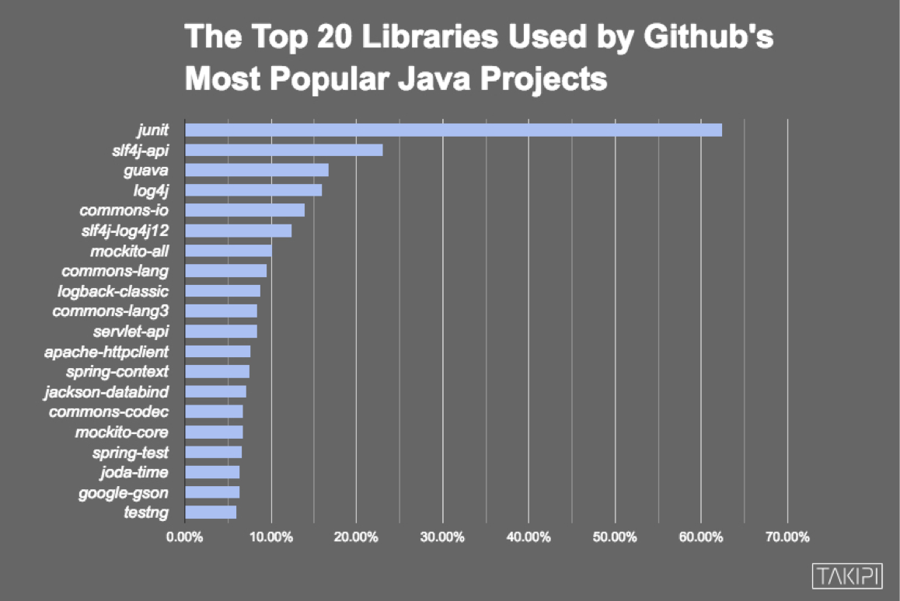
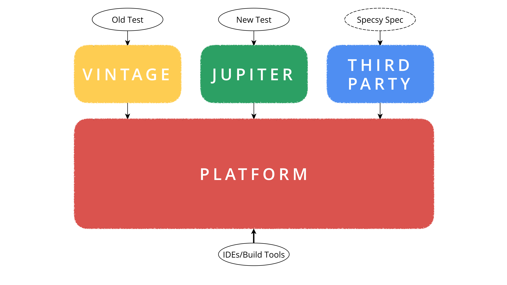

slidenumbers: true

# Modularization


---

# JUnit 4

One JAR to rule them all…


---



###### <http://blog.takipi.com/the-top-100-java-libraries-in-2016-after-analyzing-47251-dependencies/>

---



---


---

# [fit] Benefits of New Architecture

- Clearly separated APIs for test authors and build tools/IDEs
- Stable _Platform_ with an SPI for _test engines_
- _Jupiter_ API and test engine can evolve independently from _Platform_
- _Vintage_ test engine provides backward compatibility


---

# [fit] JUnit 5
# [fit] = Platform
# [fit] + Jupiter
# [fit] + Vintage


---

# Compatibility


---

# Backward Compatibility

You can run “Vintage” JUnit 4 tests with the JUnit Platform using the JUnit Vintage Engine.

```xml
<plugin>
    <artifactId>maven-surefire-plugin</artifactId>
    <version>2.19.1</version>
    <dependencies>
        <!-- ... -->
        <dependency>
            <groupId>org.junit.vintage</groupId>
            <artifactId>junit-vintage-engine</artifactId>
            <version>4.12.0-M4</version>
        </dependency>
    </dependencies>
</plugin>
```

---

# Forward Compatibility

The JUnit Platform provides a JUnit 4 `Runner` that can be used to run tests on the JUnit Platform.

```java
import org.junit.jupiter.api.Test;

@RunWith(JUnitPlatform.class)
public class JupiterTest {
    @Test
    void someTest() {
        // test something
    }
}
```

---

# `JUnitPlatform` in Suite Mode

The `Runner` can also be used to build a test suite:

```java
@RunWith(JUnitPlatform.class)
@SelectPackages("com.acme")
@IncludeEngines({"junit-jupiter", "junit-vintage"})
public class JUnit4SuiteDemo {
    // this class can be run using JUnit 4
}
```

… with some limitations, e.g. no support for dynamic tests.

---

# [fit] Benefits of Compatibility

- Backward compatibility enables gradual migration to new API: there's no need to migrate all tests at once.
- Forward compatibility provides a way to execute new tests with IDEs and build tools that don't support JUnit 5, yet.


